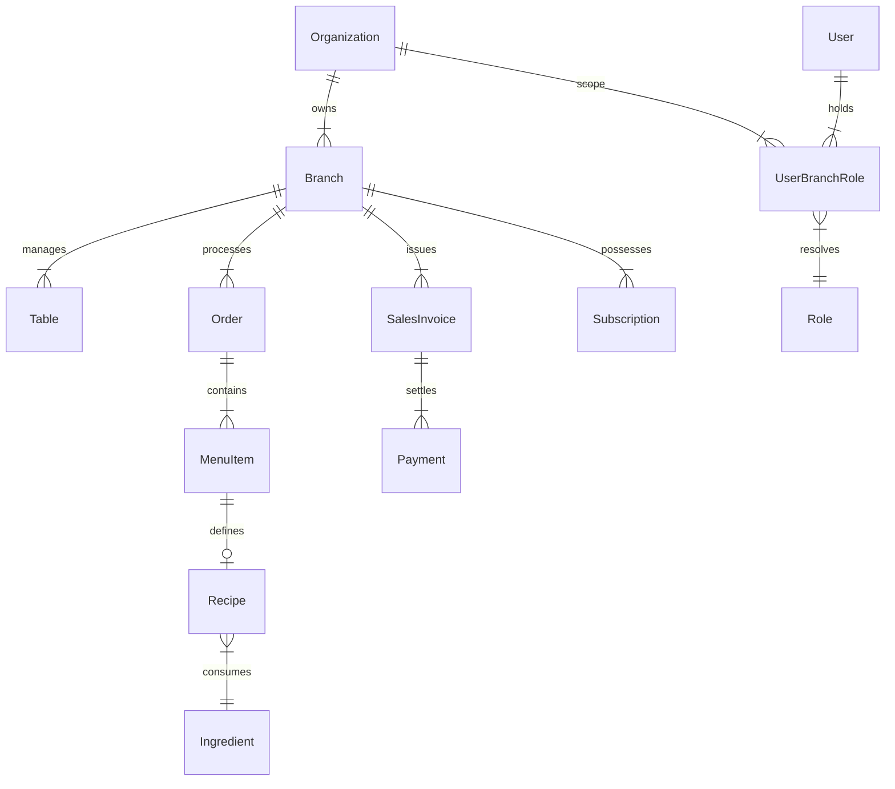

# HotelOms Database Schema & Architecture Design

This document details the MongoDB database architecture, collection schemas, entity relationships, and indexing strategies for the HotelOms system.

---

## 1. Entity-Relationship Overview

---

## 2. Platform Domain

Platform-level collections control SaaS tiering, global administrative access, and cross-tenant auditing.

### `PlatformAdmin` (`platformadmins`)
Global administrative credentials for system operators.
- `name` (String, Required)
- `email` (String, Required, Unique, Lowercase)
- `password` (String, Required)
- `is_active` (Boolean, Default: `true`)
- `role` (String, Default: `'superadmin'`)
- *Timestamps*: `createdAt`, `updatedAt`

### `Plan` (`plans`)
SaaS tier configurations and resource limits.
- `name` (String, Required)
- `price` (Number, Required)
- `billing_cycle` (String, Enum: `['monthly', 'yearly']`, Required)
- `description` (String)
- `features` (Map of Boolean)
- `is_active` (Boolean, Default: `true`)
- `is_deleted` (Boolean, Default: `false`)
- `trial_days` (Number, Default: `0`)
- `created_by` (ObjectId -> `User`)
- *Timestamps*: `createdAt`, `updatedAt`

### `Subscription` (`subscriptions`)
Active subscription status per branch.
- `branchId` (ObjectId -> `Branch`, Required, Unique)
- `planId` (ObjectId -> `Plan`)
- `planName` (String, Default: `'Free Plan'`)
- `tier` (String, Default: `'free'`)
- `status` (String, Enum: `['active', 'trial', 'cancelled', 'expired']`, Default: `'active'`)
- `expiryDate` (Date)
- `features` (Map of Boolean)
- `maxMembers` (Number, Default: `2`)
- `maxTables` (Number, Default: `10`)
- `maxCustomers` (Number, Default: `10`)
- `maxDishes` (Number, Default: `100`)
- `maxAddOns` (Number, Default: `5`)
- `maxSpaces` (Number, Default: `0`)
- *Timestamps*: `createdAt`, `updatedAt`

---

## 3. Organization & Branch Domain

### `Organization` (`organizations`)
Represents a multi-branch restaurant or hotel business entity.
- `name` (String, Required)
- `slug` (String, Unique, Lowercase, Sparse)
- `billingEmail` (String)
- `active` (Boolean, Default: `true`)
- `archivedAt` (Date)
- `archivedBy` (ObjectId -> `User`)

### `Branch` (`branches`)
Represents an individual operational branch.
- `orgId` (ObjectId -> `Organization`, Required)
- `name` (String, Required)
- `address` (String)
- `phone` (String)
- `email` (String)
- `active` (Boolean, Default: `true`)

---

## 4. Identity & Authorization Domain

### `User` (`users`)
Global identity store across all branches.
- `name` (String, Required)
- `email` (String, Required, Unique, Lowercase)
- `phone` (String, Unique, Sparse)
- `password` (String) - Optional for Firebase users
- `firebaseUid` (String, Unique, Sparse)
- `isPlatformAdmin` (Boolean, Default: `false`)
- `role` (String, Enum: `['superadmin', 'admin', 'waiter', 'kitchen']`, Required)
- `resetPasswordToken` (String)
- `resetPasswordExpires` (Date)
- *Timestamps*: `createdAt`, `updatedAt`

### `UserBranchRole` (`userbranchroles`)
Maps users to specific branches and permissions.
- `userId` (ObjectId -> `User`, Required)
- `branchId` (ObjectId -> `Branch`, Required)
- `orgId` (ObjectId -> `Organization`)
- `role` (String, Required, Lowercase)
- `permissions` (Array of String)
- `isOwner` (Boolean, Default: `false`)
- `status` (String, Enum: `['active', 'pending', 'inactive']`, Default: `'active'`)
- `active` (Boolean, Default: `true`)
- **Compound Index**: `{ userId: 1, branchId: 1 }` (Unique)

---

## 5. Orders & Billing Domain

### `Order` (`orders`)
Central order processing document.
- `branchId` (ObjectId -> `Branch`)
- `table` (ObjectId -> `Table`)
- `customerId` (ObjectId -> `Customer`)
- `staffId` (ObjectId -> `User`)
- `items` (Array of Embedded `orderItemSchema`):
  - `menuItem` (ObjectId -> `MenuItem`, Required)
  - `quantity` (Number, Required, Min: 1)
  - `priceAtOrderTime` (Number, Required, Min: 0)
  - `isComplimentary` (Boolean, Default: `false`)
  - `variantId` (ObjectId)
  - `variantName` (String)
  - `variantPrice` (Number)
  - `itemNote` (String)
- `totalAmount` (Number, Required)
- `subTotal` (Number)
- `discountType` (String, Enum: `['amount', 'percent']`, Default: `'amount'`)
- `discountValue` (Number, Default: `0`)
- `discountAmount` (Number, Default: `0`)
- `taxRate` (Number, Default: `0`)
- `taxAmount` (Number, Default: `0`)
- `tipsAmount` (Number, Default: `0`)
- `roundOff` (Number, Default: `0`)
- `finalAmount` (Number, Default: `0`)
- `orderType` (String, Enum: `['dine_in', 'takeaway', 'delivery', 'pickup', 'online', 'staff']`, Default: `'dine_in'`)
- `paymentStatus` (String, Enum: `['unpaid', 'partial', 'paid', 'credit']`, Default: `'unpaid'`)
- `status` (String, Enum: `['pending', 'preparing', 'ready', 'served', 'paid', 'cancelled']`, Default: `'pending'`)
- `paymentMethod` (String, Enum: `['cash', 'fonepay', 'card', 'bank', 'upi', 'wallet', 'online', 'other']`)
- `source` (String, Enum: `['staff', 'guest']`, Default: `'staff'`)
- `editLogs` (Array of Edit Records)

#### Primary Compound Indices
- `{ branchId: 1, createdAt: -1 }`
- `{ branchId: 1, status: 1, createdAt: -1 }`
- `{ branchId: 1, paymentStatus: 1, createdAt: -1 }`
- `{ branchId: 1, table: 1, status: 1 }`

---

## 6. Financial Ledger & Accounting Domain

### `SalesInvoice` (`salesinvoices`)
Legal sales tax and billing document.
- `branchId` (ObjectId -> `Branch`, Required)
- `orderId` (ObjectId -> `Order`)
- `invoiceNumber` (String, Required)
- `fiscalYear` (String)
- `subTotal` (Number, Required)
- `discountAmount` (Number, Default: `0`)
- `taxableAmount` (Number, Default: `0`)
- `taxAmount` (Number, Default: `0`)
- `grandTotal` (Number, Required)
- `paymentStatus` (String, Enum: `['unpaid', 'partial', 'paid', 'credit']`)
- `isVoid` (Boolean, Default: `false`)

### `Payment` (`payments`)
Granular payment transaction history.
- `branchId` (ObjectId -> `Branch`, Required)
- `invoiceId` (ObjectId -> `SalesInvoice`)
- `amount` (Number, Required)
- `direction` (String, Enum: `['in', 'out']`, Default: `'in'`)
- `paymentMethod` (String, Enum: `['cash', 'fonepay', 'card', 'bank', 'upi', 'wallet', 'other']`, Required)
- `paymentStatus` (String, Enum: `['paid', 'pending', 'void']`, Default: `'paid'`)
- `txnDate` (Date, Required)

---

## 7. Idempotency Domain

### `IdempotencyRequest` (`idempotencyrequests`)
Prevents duplicate financial operations across retries.
- `key` (String, Required)
- `scope` (String, Required)
- `method` (String, Required)
- `path` (String, Required)
- `branchId` (ObjectId)
- `userId` (ObjectId)
- `fingerprint` (String, Required) - SHA-256 Hash of Request Body
- `status` (String, Enum: `['pending', 'completed', 'failed']`, Default: `'pending'`)
- `responseStatus` (Number)
- `responseBody` (Mixed)
- `completedAt` (Date)
- **TTL Index**: `{ createdAt: 1 }` with expiration after 24 hours (`expireAfterSeconds: 86400`)
- **Unique Compound Index**: `{ key: 1, scope: 1, method: 1, path: 1, branchId: 1, userId: 1 }`
